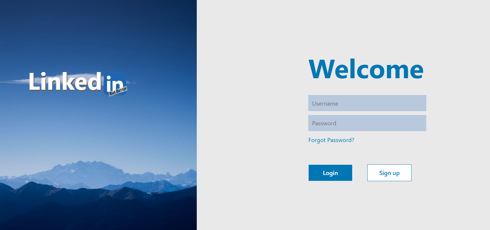
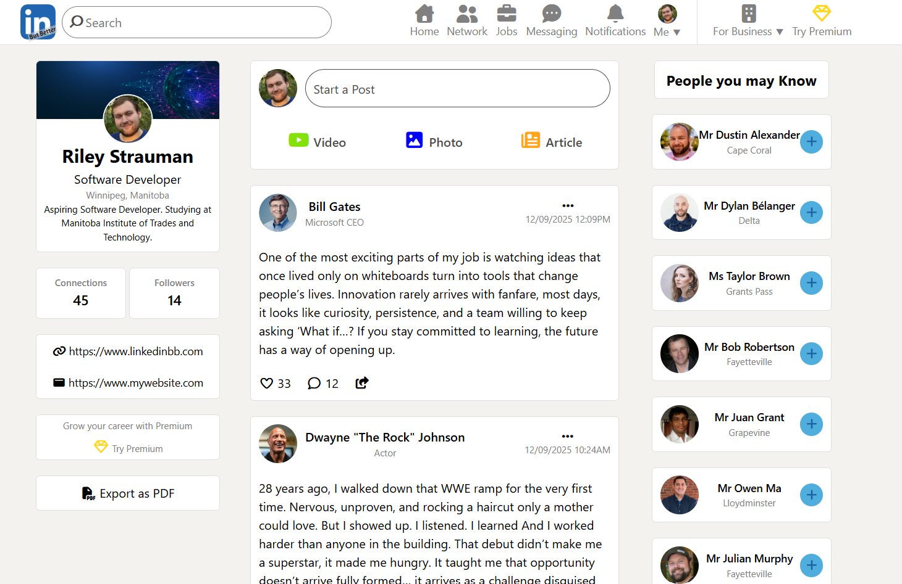
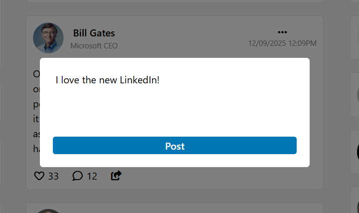

# LinkedIn But Better — Final Project: Job Finder

**Live Demo:** https://rstrauman.github.io/LinkedInButBetter/

## Overview
**LinkedIn But Better** is a two-page web application that simulates a professional social network.  
It uses the Random User Generator API to display connections, localStorage for login authentication, and a realistic 3-column LinkedIn-style layout.

---

## Features

### 🔐 Login System
- Full-screen login page
- Credentials stored and validated using localStorage
- Error message handling
- Redirects to home page after successful login
- Includes basic registration functionality

### 🏠 Home Page Layout
- Professional 3-column LinkedIn-like layout
- Header with navigation icons
- Footer with policy links
- Dynamic profile info based on logged-in user

### 🧑‍🤝‍🧑 Random User API Integration
- Fetches 10 profiles from Random User API
- Displays:
  - Profile picture
  - Full name
  - City
- Uses `seed=same` for consistent results
- Clean “People You May Know” card layout

### 📝 Posting System
- Users can create posts using a modal window
- Posts include:
  - User info
  - Timestamp
  - Likes, comments, share icons
- Posts appear instantly at the top of the feed

### 🎨 UI / UX
- LinkedIn-inspired design
- Custom “LinkedIn But Better” tape-style logo
- Consistent spacing, fonts, colors, and layout
- Icons from FontAwesome

---

## Tech Stack

- HTML5
- CSS3
- JavaScript
- LocalStorage API
- Random User Generator API
- Font Awesome

---

## Screenshots

### Login Page


### Home Feed


### Create Post Modal


---

## How to Run

1. Clone the repository

```bash
git clone https://github.com/rstrauman/LinkedInButBetter.git
```

2. Open the project folder

```bash
cd LinkedInButBetter
```

3. Launch the project using Live Server or open `index.html`

---

## What I Learned

This project helped me improve my skills with:
- DOM manipulation
- API integration
- Responsive layout design
- User authentication logic
- Dynamic UI rendering
- LocalStorage data persistence

---

## Project Status

Completed as a final web development project with plans for future improvements and additional social features.
